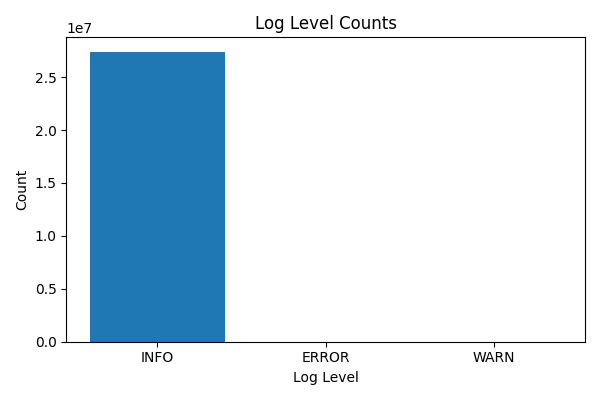
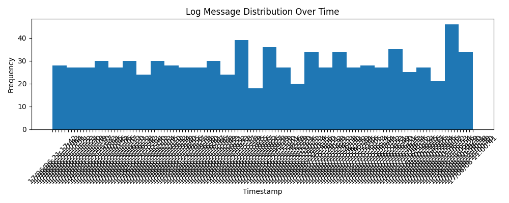

# DSAN6000 A06 – Spark Cluster Log Analysis  
### Structure
- problem 1 & 2 python files: 
    - `/cluster-files/problem1.py`  
    -  `/cluster-files/problem2.py`
- output files: 
    - `/output`

### Problem 1

- **Goal:** Aggregate Spark application logs from S3 into a structured dataset.
- **Approach:**
  - Used `pyspark` to read from `s3a://yx390-assignment-spark-cluster-logs/data/*/*`
  - Applied regex parsing to extract key fields: `timestamp`, `level`, `message`, `application_id`
  - Wrote clean data back to `data/output/problem1_cleaned.csv`
- **Findings**
    - INFO logs dominated (>99.9%), WARN and ERROR events clustered around heavy jobs.  
- **Performance**
    - local: ~ 1 minute
    - cluster: ~ 5 minutes 

### Problem 2

- **Goal:** Analyze Spark cluster usage and performance metrics.
- **Approach:**
  - Read parsed logs and computed metrics:
    - Job counts, durations, log levels
    - Timeline and cluster summary tables
  - Used `groupBy("application_id")` and aggregation on job stages.
  - Saved results to `data/output/problem2_*`
- **Visualization:**
  - Timeline of job execution durations
  - Distribution of log levels
  - Cluster workload summary per node
- **Performance**
    - ~ 20 minutes on cluster

### Additional Plots

### Test file
- Test file included in `cluster-files/test.py`
